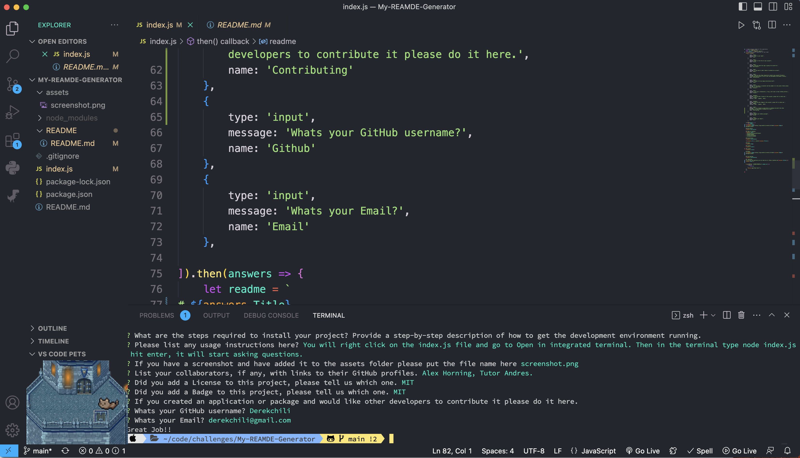
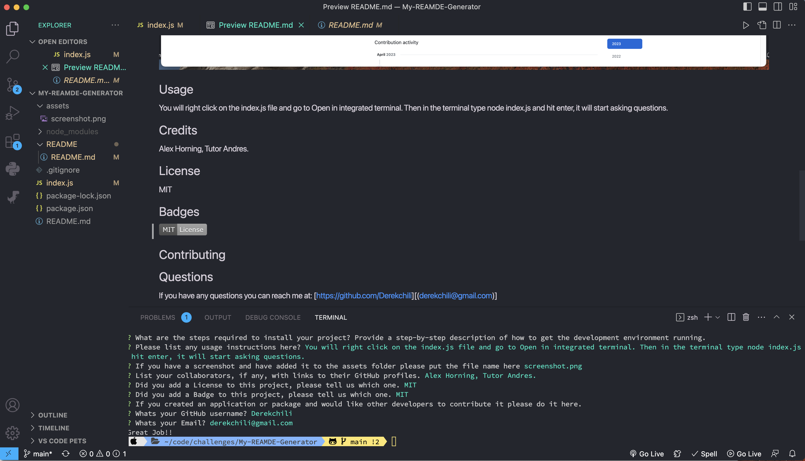

# My-README-Generator

## Description
This is going to ask you a series of questions to build a README.md file for you. I have instructions for how to use in the Usage section.

## Table of Contents
- Installation
- Usage
- Credits
- License

## Installation
Here is the video of how to use this app:
https://drive.google.com/file/d/1ur-_mOnFAS5A75k92Jl9565LvR1xEQ6J/view

Here is my github link: 
https://github.com/Derekchili/My-REAMDE-Generator.git

## Screenshot

## Usage
When you open the index.js file then right click on index.js and go to open in integrated terminal. Then in the terminal you will type in the following command: node index.js. It will then start asking you a series of questions, once done will produce a README.md inside the README folder.

## Credits
Alex Horning from class told me not to overthink this and helped a little to get it started. And then Tutor Andres helped get the badge to work I was really close.

## License
None

## Badges
None

## Contributing
none

## Questions
If you have any questions you can reach me at: [https://github.com/Derekchili][(derekchili@gmail.com)]